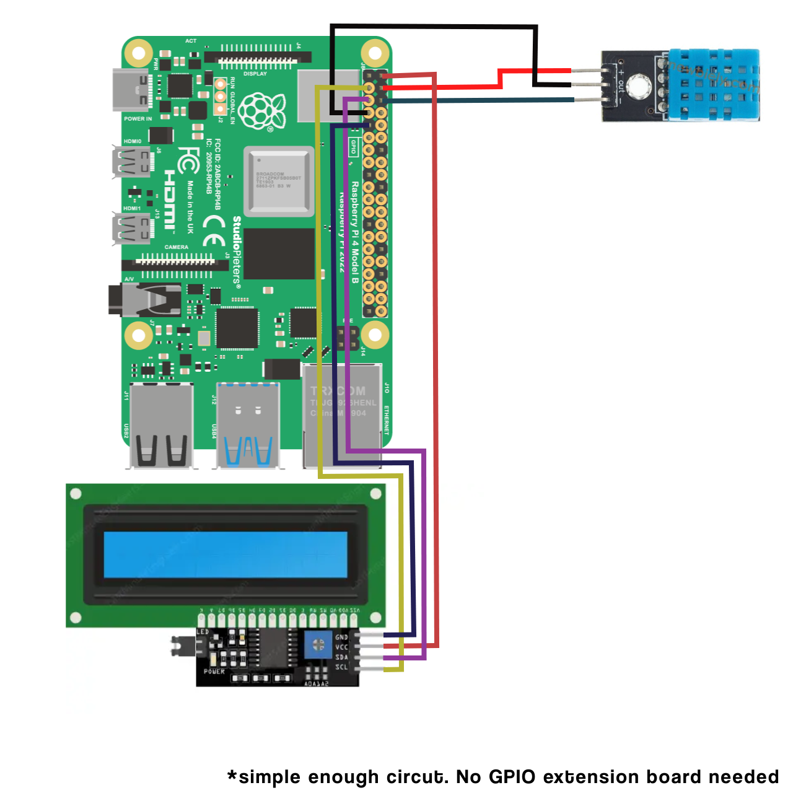
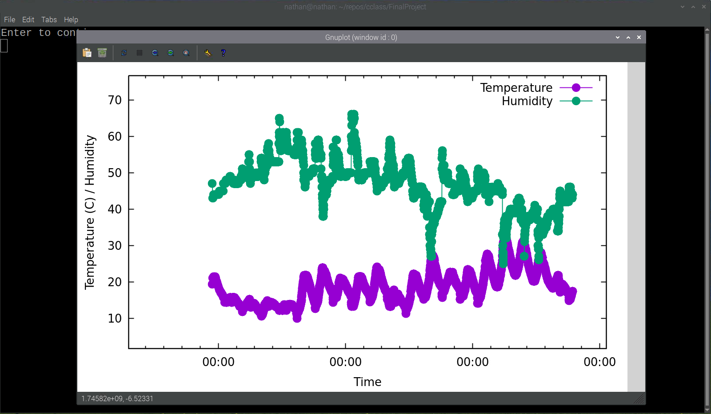

# Environmental Data Project

## Description
A C-core project made to run on a Raspberry Pi 4B, Raspbian/Linux. Uses I2C LCD and DHT11 temp/hum sensor. Stores data in MySQL.

I use "make" for the build system. The project was only build for a Raspberry Pi board, hence Linux is sufficient for the project.

## Table of Contents

- [Source Architecture](#source-architecture)
- [Dependencies](#dependencies)
- [Hardware Requirements](#hardware-requirements)
- [Installation & Setup](#installation--setup)
- [Usage](#usage)
- [Examples](#examples)

## Source Architecture

Running on a Raspberry Pi 4B
OS - Debian GNU/Linux 12 (Bookworm)
Architecture - ARM64 (aarch64)
Distribution: Raspberry Pi OS (based on Debian 12)
Kernel version - Debian 1:6.6.74-1+rpt1

## Dependencies

The external linked libraries are,
```bash
-lwiringPi -lm -lmysqlclient
```

gnuplot is also used to graph the data.

The math library (lm) should come with C tools

The wiring pi library is an open source repo at https://github.com/WiringPi/WiringPi. Creating the debian-package is the easiest way. Current instructions (subject to change)
```bash
# Fetch the source
sudo apt install git
git clone https://github.com/WiringPi/WiringPi.git
cd WiringPi

# Build the package
./build debian
mv debian-template/wiringpi-3.0-1.deb .

# Install it
sudo apt install ./wiringpi-3.0-1.deb
```

MySQL is a common package install through apt. 
```bash
# Using apt
sudo apt install libmysqlclient-dev
# Check the install ->
dpkg -l | grep libmysqlclient
```

gnuplot can be installed with apt in linux.
```bash
# Using apt
sudo apt install gnuplot
# Check the install ->
dpkg -l | grep gnuplot
```

Optionally install I2C tools to interface the LCD panel easier
```bash
# Install the tools
sudo apt-get install i2c-tools

# Reboot the system

# Retrieve the list of I2C connections
i2cdetect -y 1
```

## Hardware Requirements
I am using a DHT11 Temperature and Humidity sensor and a 16x2 LCD panel with an I2C interface. (I am not a real man using the I2C I KNOW!)

DHT11 (bare sensor, 3-pin)
16x2 LCD panel with a generic I2C interface (my address is 0x27)


*Simple circuit: no GPIO extension board needed.*

## Installation & Setup
Before installing. Make sure your [Dependencies](#dependencies) are up to date

This project requires you to set up a SQL user, database and table outside of the program.
The table data should look like this
```bash
data(TempLHS int, TempRHS int, HumLHS int, HumRHS int, time timestamp default current_timestamp);
```
If you are familiar with SQL you can skip the next part.

```bash
# Run SQL as admin
sudo mysql

# Create the database
CREATE DATABASE environmental_data;

# Create a user for the program
CREATE USER 'server'@'localhost' IDENTIFIED BY 'default';
GRANT ALL PRIVILEGES ON environmental_data.* TO 'server'@'localhost';

# Setup the database
USE environmental_data
CREATE table data_main(TempLHS int, TempRHS int, HumLHS int, HumRHS int, time timestamp default current_timestamp);

QUIT
```

```bash
# Clone the repository
git clone https://github.com/NathanJColbert/EnvironmentalDataCProject.git

# Navigate into the directory
cd EnvironmentalDataCProject

# (Optional) set environment variables for database access
# The program will prompt you if they are not set
export EN_SERVER='localhost'
export EN_USER='server'
export EN_PASSWORD='default'
export EN_DATABASE='environmental_data'
export EN_TABLE='data_main'

# I use make for the build system.
mkdir build
make run
```

## Usage
Once built, the program will attempt to read data from the DHT11 sensor and write it to your SQL database. It will display temperature, humidity, and time on the LCD screen using the Linux system time via the C standard library.

Valid command line arguments. Hexadecimal is supported (using 0x{value}).
- -lcd_address {Decimal}
- -dht11_pin {Decimal}
- -rate {Decimal}
- -read_tries {Decimal}
- -store_tries {Decimal}

```bash
# Build and run
make
cd build
./program
OR
./program -rate 300 ...

# Quick Run
make run
OR
make run ARGS="-lcd_address 0x27 -rate 300 ..."

# Clean build
make clean
```

## Examples
I have been running my program over the span of ~3 weeks. The Hardware was in my garage (I felt it was the most environmentally changing area; not outside).

[ 2025-04-23 15:39:02 - 2025-05-13 12:03:59 ]

Gathering a data point at every ~10 minutes (I re-compiled and ran the program multiple times so 10 minute intervals is not 100% accurate).

Listing the data of one day looks like,


And Graphed,


Listing all my data (3 weeks),


To fahrenheit ->


And Graphed,



This data took ~5 seconds to graph (too long!)

Looking at my data you can see the spikes and dips of temperature / humidity. They are opposite to each other. This makes sense, because I live near the ocean; when it gets colder I.E. the cold air from the ocean comes in, the humidity increases due to the ocean air.

Now, graphing just the temperature in fahrenheit,


We can see an upward trend. It is approaching summer time.
